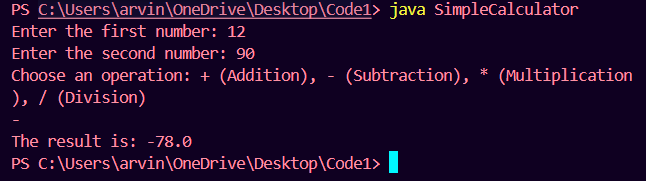

# Overview
* This project is a simple calculator program implemented in Java. It supports basic arithmetic operations such as addition, subtraction, multiplication, and division, and includes a user-friendly graphical interface.

## Table of Contents
- [Requirements](#requirements)
- [Files](#files)
- [How to Run](#how-to-run)
- [Example Output](#example-output)

## Requirements
* Java Development Kit (JDK) 17 or higher
* Integrated Development Environment (IDE) such as IntelliJ IDEA or Eclipse

# You can install these libraries using pip:
bash
pip install pandas numpy matplotlib seaborn

# Clone repository
bash
git remote add origin 

## Files

## How to Run

1. Compile the Java Files:

* If using the command line, navigate to the directory containing the .java files and run:

bash
javac Calculator.java CalculatorGUI.java

* If using an IDE, simply open the project and build it.

2. Run the Program:

* If using the command line, run the compiled program:
bash
java Calculator

## Example Output

# Author
* Pankaj Kumar - https://github.com/pankajk12
